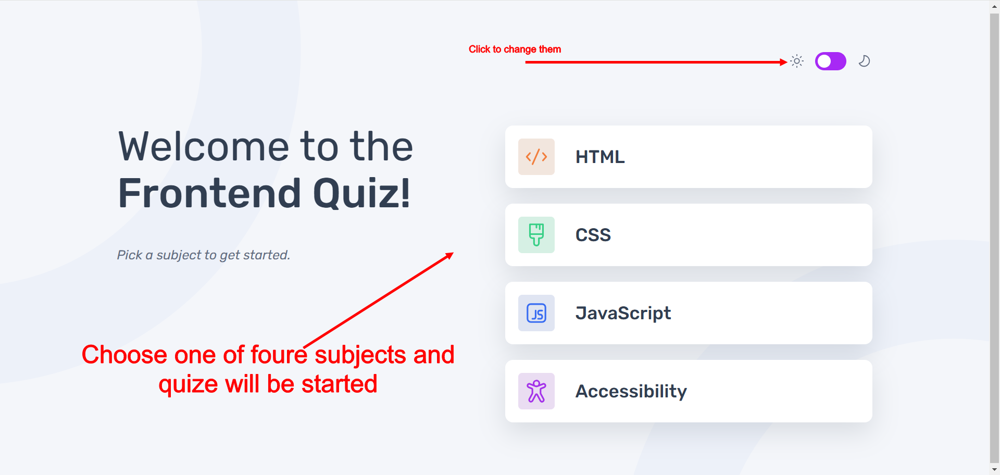
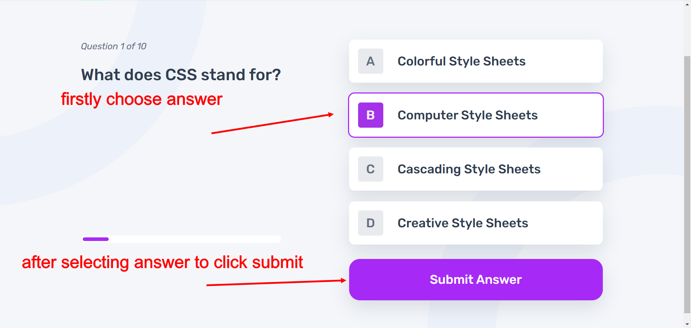
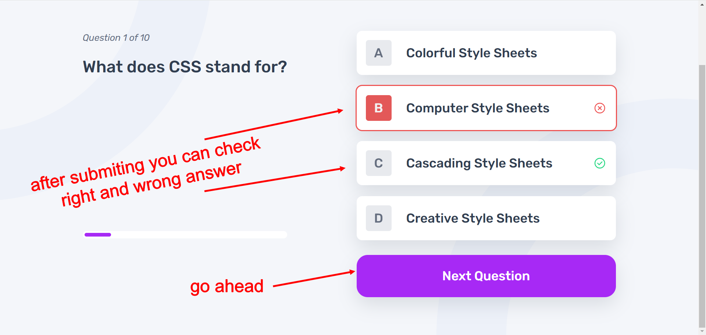
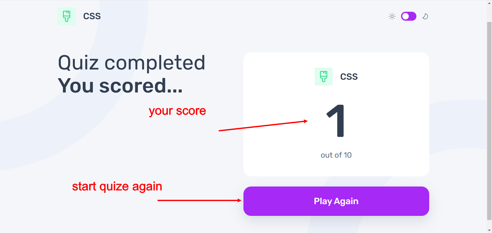

# Frontend Mentor - Frontend quiz app solution

This is a solution to the [Frontend quiz app challenge on Frontend Mentor](https://www.frontendmentor.io/challenges/frontend-quiz-app-BE7xkzXQnU). Frontend Mentor challenges help you improve your coding skills by building realistic projects. 

## Table of contents

- [Overview](#overview)
  - [The challenge](#the-challenge)
  - [Screenshot](#screenshot)
  - [Links](#links)
- [My process](#my-process)
  - [Built with](#built-with)
  - [What I learned](#what-i-learned)
  - [Continued development](#continued-development)
  - [Useful resources](#useful-resources)
- [Author](#author)
- [Acknowledgments](#acknowledgments)

## Overview

### The challenge

Users should be able to:

- Select a quiz subject
- Select a single answer from each question from a choice of four
- See an error message when trying to submit an answer without making a selection
- See if they have made a correct or incorrect choice when they submit an answer
- Move on to the next question after seeing the question result
- See a completed state with the score after the final question
- Play again to choose another subject
- View the optimal layout for the interface depending on their device's screen size
- See hover and focus states for all interactive elements on the page
- Navigate the entire app only using their keyboard
- **Bonus**: Change the app's theme between light and dark

### Screenshots







### Links

- Solution URL: [GitHub](https://github.com/DmytroVoitovych/Frontend-Quiz-app)
- Live Site URL: [Live page](https://dmytrovoitovych.github.io/Frontend-Quiz-app/)

## My process

### Built with
- TypeScript
- Semantic HTML5 markup
- CSS custom properties
- Flexbox
- CSS Grid
- Mobile-first workflow
- [Custom Event](https://developer.mozilla.org/en-US/docs/Web/API/Event/Event) - Event Constructor
- [React](https://reactjs.org/) - JS library
- [Motion](https://motion.dev/) - animation library
- [Emotion Styled Components](https://emotion.sh/docs/styled) - For styles


### What I learned

I learned that React requires a very different approach compared to Vue, which means you need to pay more attention to designing the logic of your application before starting to write any code. For me, it was a good experience to dive a little deeper into React again, as I hadn't used it for at least a year.

The main takeaway for me was **think more before and write less after.** React encourages you to stay focused because it's easy to make mistakes compared to Vue.js.

I’m sharing this code with you because one of my top-level components needed to receive a signal from a descendant component, and I needed to implement a solution without using context or an external state manager, see below:

```ts
const [topic] = useLocaleStorage(STORAGE_TOPIC);
const [num, setNum] = useState<number>();

  forceUpdate.force = (top: string) => {
    trigger = +top; (trigger is global)
    window.dispatchEvent(new Event(RESTART_EVENT));
  };

  useEffect(() => {
    const topicTrigger = () => {
      setNum(trigger);
    };

    window.addEventListener(RESTART_EVENT, topicTrigger);

    return () => {
      window.removeEventListener(RESTART_EVENT, topicTrigger);
    };
  }, []);
```
### Continued development

Depending on my next project, I will choose Vue.js, or if the project is more complex, I will use Next.js, as it is recommended in the official React documentation. Preferably, I would like to explore new React hooks, such as **useActionState, useOptimistic, and useTransition**. I simply have a strong desire to learn more and refresh my knowledge.

### Useful resources

- [Input control](https://react.dev/reference/react-dom/components/input#troubleshooting) - This helped me to use input like progress decor.
- [State in Deep](https://react.dev/learn/state-as-a-snapshot) - It inspired me to use custom event to get nedded result.

## Author

- Website - [Dmytro Voitovych](https://portfolio-dmytrovoitovych.vercel.app/)
- Frontend Mentor - [@dmytrovoitovych](https://www.frontendmentor.io/profile/DmytroVoitovych)

